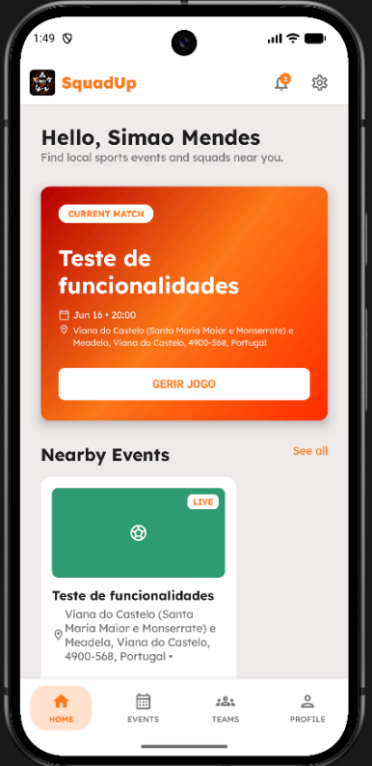
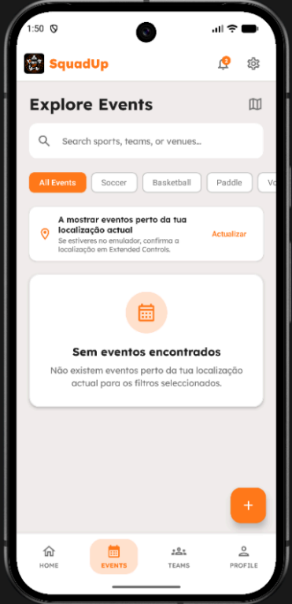
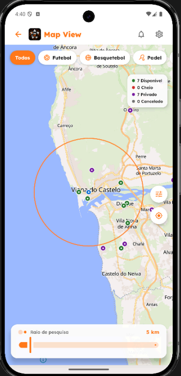
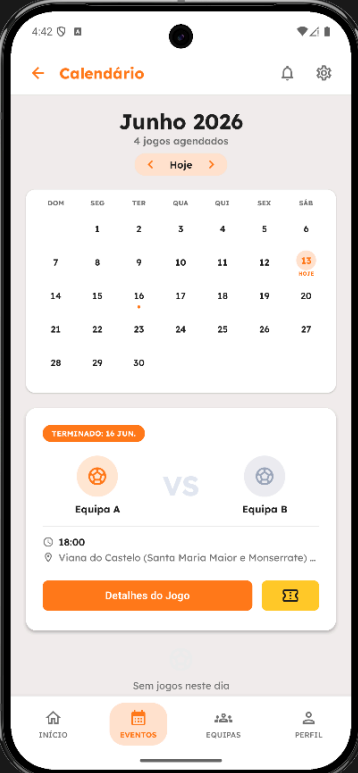
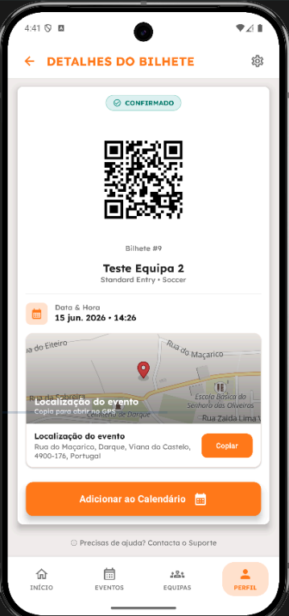
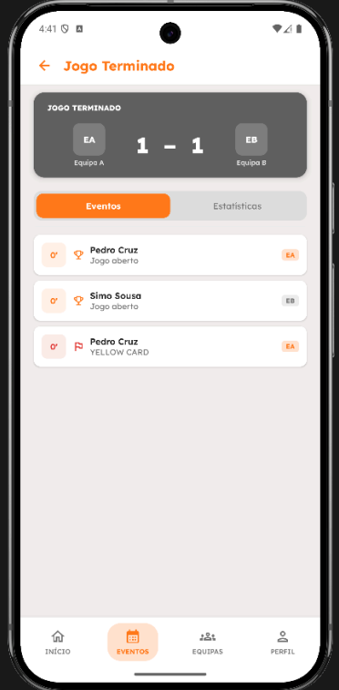
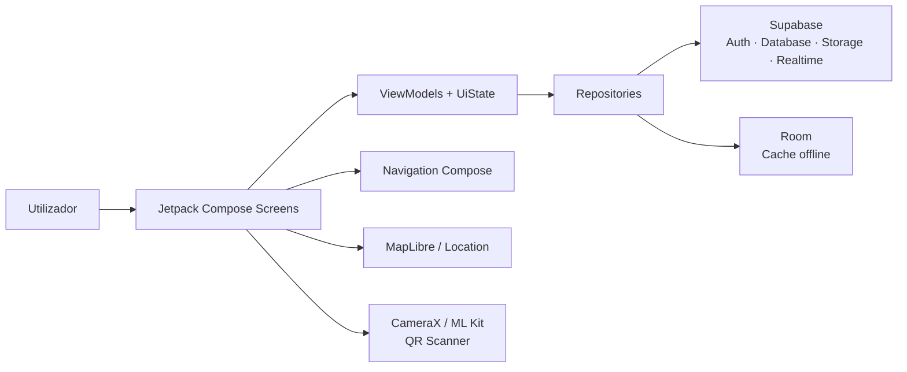

<table width="100%">
  <tr>
    <td valign="middle" width="74%">

<h1>SquadUp 🏆</h1>

<p>
  <strong>SquadUp</strong> é uma aplicação móvel Android para <strong>gestão de eventos desportivos</strong>, desenvolvida em <strong>Kotlin</strong> com <strong>Jetpack Compose</strong>.
</p>

<p>
  A aplicação permite descobrir, criar e gerir eventos desportivos, organizar equipas, gerir inscrições, acompanhar jogos em directo, consultar bilhetes e administrar contas. O backend é suportado pelo <strong>Supabase</strong>, usado para autenticação, base de dados, storage, realtime e funções auxiliares.
</p>

<p>
  
  
  
  
  
</p>

</td>
<td align="center" valign="middle" width="26%">
  
</td>
  </tr>
</table>

---

## Funcionalidades

### Utilizadores e autenticação

* onboarding inicial da aplicação;
* registo, login, recuperação e alteração de palavra-passe;
* perfis com diferentes tipos de utilizador, como administrador, organizador e jogador;
* edição de perfil, localização, modalidades de interesse e estilo de jogo;
* suporte de interface em **Português de Portugal** e **Inglês**.

### Eventos desportivos

* pesquisa e exploração de eventos;
* filtros por modalidade, localização e eventos próximos;
* visualização de eventos em mapa;
* criação de eventos em vários passos;
* suporte a eventos públicos e privados;
* formatos como jogo único, liga, eliminatória, grupos + eliminatória e formato aberto;
* gestão de eventos criados pelo organizador.

### Equipas e inscrições

* criação e gestão de equipas;
* convites para equipas;
* pedidos de adesão por código;
* gestão de membros e capitães;
* inscrição individual ou por equipa em eventos;
* fluxo de confirmação de inscrição e emissão de bilhete.

### Jogos em directo

* criação e edição de jogos associados a eventos;
* acompanhamento de jogos em directo;
* actualização de resultado, estatísticas e timeline;
* registo de acontecimentos como pontos, faltas, substituições e tempos técnicos;
* suporte offline parcial com cache local e sincronização posterior.

### Bilhetes, notificações e administração

* consulta de bilhetes do utilizador;
* detalhe de bilhete;
* leitura e validação de QR codes;
* notificações relacionadas com eventos, equipas e convites;
* painel de administração com métricas gerais;
* gestão de contas, estados e permissões.

---

## Demonstração

<p align="center">
  Alguns ecrãs principais da aplicação:
</p>

<table align="center">
  <tr>
    <td align="center">
      <b>Início</b><br />
      
    </td>
    <td align="center">
      <b>Eventos</b><br />
      
    </td>
    <td align="center">
      <b>Mapa de eventos</b><br />
      
    </td>
  </tr>
  <tr>
    <td align="center">
      <b>Calendário</b><br />
      
    </td>
    <td align="center">
      <b>Bilhete</b><br />
      
    </td>
    <td align="center">
      <b>Jogo terminado</b><br />
      
    </td>
  </tr>
</table>

---

## Arquitectura

O projeto segue uma organização por funcionalidades, com separação entre interface, estado, navegação, repositories e integração com serviços externos.



### Organização principal

| Área                          | Responsabilidade                                                                |
| ----------------------------- | ------------------------------------------------------------------------------- |
| `core`                        | navegação, tema, componentes comuns, permissões, cliente Supabase e utilitários |
| `features/auth`               | login, registo, recuperação e alteração de palavra-passe                        |
| `features/home`               | página inicial, eventos próximos e destaques                                    |
| `features/events`             | listagem, mapa, detalhe, criação, edição e gestão de eventos                    |
| `features/events/livematch`   | jogo em directo, estatísticas, timeline, cache local e sincronização            |
| `features/events/manageevent` | gestão operacional de eventos, equipas, inscrições, jogos e QR scanner          |
| `features/teams`              | equipas, convites, membros e pedidos de adesão                                  |
| `features/profile`            | perfil, bilhetes, eventos do utilizador e definições                            |
| `features/payment`            | confirmação de inscrição e geração de bilhetes                                  |
| `features/notifications`      | notificações e interacções com convites/eventos                                 |
| `features/admin`              | dashboard administrativo e gestão de contas                                     |
| `features/onboarding`         | apresentação inicial da aplicação                                               |

---

## Tecnologias

* **Kotlin** — linguagem principal;
* **Android / Gradle** — projeto Android nativo;
* **Jetpack Compose** — interface declarativa;
* **Material 3** — componentes visuais;
* **Navigation Compose** — navegação entre ecrãs;
* **ViewModel, StateFlow e Lifecycle** — gestão de estado e ciclo de vida;
* **Supabase** — autenticação, PostgREST, Storage, Realtime e Functions;
* **Ktor OkHttp Client** — comunicação HTTP usada pelas bibliotecas Supabase;
* **Kotlinx Serialization** — serialização de modelos;
* **MapLibre** — mapas e selecção de localização;
* **Google Play Services Location** — localização do dispositivo;
* **Room** — cache local e suporte offline parcial;
* **DataStore Preferences** — persistência local de preferências;
* **CameraX, ML Kit Barcode Scanning e ZXing** — leitura e validação de QR codes;
* **Coil** — carregamento de imagens;
* **JUnit, AndroidX Test, Espresso e Compose UI Test** — testes unitários e instrumentados.

---

## Estrutura do projeto

```text
.
├── app/
│   ├── src/
│   │   ├── main/
│   │   │   ├── java/com/example/squadup/
│   │   │   │   ├── core/          # Navegação, tema, componentes, Supabase e utilitários
│   │   │   │   ├── features/      # Funcionalidades da aplicação
│   │   │   │   └── MainActivity.kt
│   │   │   ├── res/               # Strings, temas, imagens, ícones, fontes e XML Android
│   │   │   └── AndroidManifest.xml
│   │   ├── test/                  # Testes unitários
│   │   └── androidTest/           # Testes instrumentados
│   ├── build.gradle.kts
│   └── proguard-rules.pro
├── gradle/
│   ├── libs.versions.toml
│   └── wrapper/
├── build.gradle.kts
├── settings.gradle.kts
├── gradlew
└── gradlew.bat
```

---

## Pré-requisitos

* Android Studio;
* JDK compatível com o projeto;
* Android SDK com suporte para `compileSdk 36`;
* emulador Android ou dispositivo físico;
* projeto Supabase configurado com as tabelas, permissões e funções esperadas pela aplicação.

---

## Configuração

O projeto lê as credenciais do Supabase através do ficheiro `local.properties`, que não deve ser versionado.

Na raiz do repositório, criar ou actualizar:

```properties
SUPABASE_URL=https://<project-id>.supabase.co
SUPABASE_ANON_KEY=<supabase-anon-key>
```

Estes valores são expostos ao código através de:

```text
BuildConfig.SUPABASE_URL
BuildConfig.SUPABASE_ANON_KEY
```

> A aplicação Android deve usar apenas a chave pública `anon`. Chaves privadas, como `service_role`, não devem ser usadas no cliente nem guardadas no repositório.

---

## Como executar

### Android Studio

1. Abrir a pasta do repositório no Android Studio.
2. Aguardar pela sincronização Gradle.
3. Confirmar que o ficheiro `local.properties` contém as chaves do Supabase.
4. Seleccionar um emulador ou dispositivo físico.
5. Executar a configuração `app`.

### Linha de comandos

Gerar build debug:

```bash
./gradlew assembleDebug
```

No Windows:

```bash
gradlew.bat assembleDebug
```

Instalar no dispositivo/emulador ligado:

```bash
./gradlew installDebug
```

---

## Testes

Testes unitários:

```bash
./gradlew test
```

Testes instrumentados:

```bash
./gradlew connectedAndroidTest
```

> Os testes instrumentados requerem um emulador ou dispositivo físico ligado.

---

## Estado do projecto

Projecto académico desenvolvido para a unidade curricular de **Computação Móvel**, no âmbito do **Tema 2 - Gestão de Eventos Desportivos**.

A versão actual inclui autenticação, eventos, equipas, inscrições, bilhetes, mapa, notificações, administração, jogos em directo, suporte offline parcial e testes. Algumas funcionalidades dependem da configuração correcta do backend Supabase, incluindo tabelas, permissões, storage, realtime e funções auxiliares.

---

## Autores

* [Simão Mendes](https://github.com/SimaoMendes30)
* [Diogo Fontes](https://github.com/Fontezilla)
* [Pedro Cruz](https://github.com/pedrojcruz)
* [Simão Sousa](https://github.com/simaosousa10)
